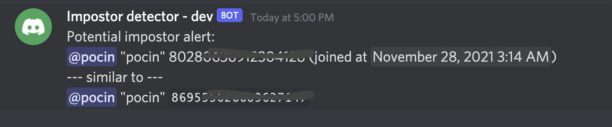

# Simple impostor detector bot

**Single guild setup for demonstration purposes/self hosting.**

## What it does


Whenever user changes their username or joins your guild:

1) their display name is checked against all server usernames
   - if similar name is found and the target has one of the roles defined in `MONITORED_ROLES`.
   - the username contains forbidden keywords (`BLACKLIST_KEYWORDS`) eg. `support` or `admin` or `help desk`

2) if any of the conditions above is satisfied a message is sent to `MODERATION_CHANNEL_NAME` to alert the moderators so they can investigate.

## What it does not do
- kick/ban or make any decisions.
- Check existing users

Merely warns of a **new** suspicious activity.


## Run
### Configuration
- `MONITORED_ROLES` - you should set it to the important roles in your guild that scammers might want to impersonate (moderators/admins)
- `BLACKLIST_KEYWORDS` - A list of words that likely scammer might impersonate (custommer support, admin, `help desk`)
- `MODERATION_CHANNEL_NAME` - a text channel where bot has write access to. Used to report suspicious users.


Your discord bot should
- have `GUILD_MEMBERS` priviledged intent
- have write access to `MODERATION_CHANNEL_NAME`
- have `SEND_MESSAGES` permission

If you change `YOUR_CLIENT_ID` in the link below, you can use it to authorize the bot with correct permissions:
`https://discord.com/api/oauth2/authorize?client_id=YOUR_CLIENT_ID&permissions=2048&scope=bot`


``` sh
$ cp env-template .env
```
and edit the variables according to your needs

```sh
$ yarn install
$ yarn build
$ yarn start
```
